# 📄 System Flow & Approach — AI Resume Builder & ATS Optimization Agent

## 1. Overview

This project is an **AI-powered resume optimization agent** that helps users build ATS-friendly resumes. It combines traditional mechanical text analysis with multi-provider AI (Groq, Gemini, OpenAI) to deliver actionable feedback, keyword optimization, and professional resume generation.

The system follows a **4-step agentic workflow**: Upload → Analyze → Enhance → Export.

---

## 2. System Flow

```mermaid
flowchart TD
    A[👤 User Uploads Resume<br/>PDF / DOCX] --> B[📄 Resume Parser<br/>Text Extraction + Metadata]
    B --> C{Step 2: Job Analysis}
    C --> D[User enters Job Title,<br/>Company, Job Description]
    D --> E[📊 ATS Scorer<br/>Orchestrator]

    E --> F[🔧 Mechanical Analyzer<br/>Compliance Checks]
    E --> G[🤖 AI Evaluator<br/>Multi-Provider]

    F --> H[Combine: 80% AI + 20% Mechanical]
    G --> H

    H --> I[Step 3: Dashboard<br/>Score + Feedback + Keywords]

    I --> J{User Action}
    J -->|Enhance| K[✨ AI Enhancement<br/>Grammar / Keywords / Tone]
    J -->|Chat| L[💬 AI Consultant<br/>Resume Q&A]
    J -->|Export| M[📝 PDF/DOCX Generator<br/>LaTeX Templates]

    K --> N[Re-Score]
    N --> I

    style A fill:#e0f2fe
    style I fill:#f0fdf4
    style M fill:#fef3c7
```



### Step-by-Step Flow

| Step | Component | What Happens |
|------|-----------|-------------|
| **1. Upload** | `UploadForm.jsx` → `/parse` | User uploads a PDF/DOCX. `ResumeParser` extracts text, email, and phone using PyPDF/python-docx and regex. |
| **2. Job Analysis** | `JobAnalysis.jsx` → `/score` | User enters the target Job Title, Company, and Job Description. `ATSScorer` orchestrates the full analysis. |
| **3. Dashboard** | `Dashboard.jsx` | Displays the ATS score, section breakdown, keyword analysis, compliance checks, and optimization suggestions. |
| **4. Export** | `Dashboard.jsx` → `/generate` | User selects format (PDF/DOCX) and template (Classic/Modern/Minimal). `PDFGenerator` renders LaTeX and compiles to PDF. |

---

## 3. AI Agent Approach

### 3.1 Multi-Provider Fallback Chain

The AI agent uses a **priority-based fallback system** to ensure reliability:

```
Request → Groq (Free, Llama 3.3 70B)
              ↓ fail
          → Gemini (Free tier, Gemini 2.0 Flash)
              ↓ fail
          → OpenAI (Paid, GPT-3.5 Turbo)
              ↓ fail
          → Error: "All providers failed"
```

**Why this approach?**
- **Cost efficiency**: Groq is free with 14,400 requests/day.
- **Reliability**: If one provider is rate-limited (429), the system automatically tries the next.
- **No code changes needed**: Adding a new provider only requires a new `_enhance_<provider>` method.

### 3.2 AI Capabilities

| Capability | Endpoint | Agent Behavior |
|-----------|----------|---------------|
| **ATS Scoring** | `/score` | Sends resume + job description to AI with a structured JSON prompt. AI returns section scores, keyword analysis, and feedback. |
| **Text Enhancement** | `/enhance` | Rewrites text based on `type`: `grammar`, `keywords`, `general`, `summary`, `bullet_points`. |
| **Chat Consultant** | `/chat` | Conversational AI with full resume context for personalized advice. |

### 3.3 Scoring Algorithm

The ATS score combines two analysis layers:

```
Final Score = (AI Score × 0.8) + (Mechanical Score × 0.2)
```

**Layer 1 — Mechanical Analysis** (`ats_analyzer.py`):
- Contact info validation (email, phone, LinkedIn)
- Section header detection (Experience, Education, Skills)
- Formatting checks (bullet points, page count, date consistency)
- Table/column detection (ATS-unfriendly layouts)
- Special character and file size checks

**Layer 2 — AI Analysis** (`ai_enhancer.py`):
- Weighted keyword matching (Critical vs. Recommended)
- Hard/Soft skill categorization
- Keyword stuffing & acronym detection
- Action verb strength and quantification scoring
- Grammar, spelling, and reverse-chronological order checks

**Fallback**: If AI fails, the system uses a heuristic keyword-matching score:
```
Fallback Score = (Mechanical × 0.4) + (Heuristic × 0.6)
```

---

## 4. Core Modules

### Backend (Python / FastAPI)

| Module | Responsibility |
|--------|---------------|
| `main.py` | FastAPI app, CORS, routing, request/response models |
| `resume_parser.py` | Extracts text from PDF (PyPDF) and DOCX (python-docx), regex for email/phone |
| `ats_scorer.py` | Orchestrates mechanical + AI scoring, produces final combined score |
| `ats_analyzer.py` | 10+ mechanical compliance checks (parsing, contact, formatting, dates, etc.) |
| `ai_enhancer.py` | Multi-provider AI calls with fallback chain, prompt engineering for each task |
| `pdf_generator.py` | Jinja2 + LaTeX templates, special character escaping, pdflatex compilation |

### Frontend (React / Vite)

| Component | Responsibility |
|-----------|---------------|
| `UploadForm.jsx` | Resume upload (drag & drop) + manual resume builder form |
| `JobAnalysis.jsx` | Job description input, triggers ATS scoring |
| `Dashboard.jsx` | Score display, AI enhancement buttons, chat, export controls |
| `LiveEditor.jsx` | Real-time resume editing with live preview |
| `api.js` | Axios-based API client for all backend communication |

---

## 5. PDF Generation Pipeline

```
User Data → LaTeX Escape (& → \&, % → \%, etc.)
          → Jinja2 Template Rendering (classic.tex / modern.tex)
          → pdflatex Compilation
          → PDF File Served via /output endpoint
```

Templates use LaTeX-safe Jinja2 delimiters (`\VAR{}`, `\BLOCK{}`) to avoid conflicts with LaTeX's `{}` syntax.

---

## 6. Tech Stack Summary

| Layer | Technology |
|-------|-----------|
| Frontend | React 18, Vite, Axios |
| Backend | Python 3.10+, FastAPI, Uvicorn |
| AI Providers | Groq (Llama 3.3 70B), Google Gemini 2.0 Flash, OpenAI GPT-3.5 |
| Parsing | PyPDF, python-docx |
| PDF Generation | Jinja2 + LaTeX (pdflatex) |
| Environment | python-dotenv, CORS middleware |

---

## 7. Running the Project

```bash
# Backend
cd backend && source venv/bin/activate
pip install -r requirements.txt
cp .env.example .env   # Add at least one API key
python main.py          # Runs on http://localhost:8000

# Frontend (separate terminal)
cd frontend && npm install && npm run dev  # Runs on http://localhost:5173
```

> **Note**: PDF generation requires `pdflatex` (MacTeX on macOS: `brew install --cask mactex`).
